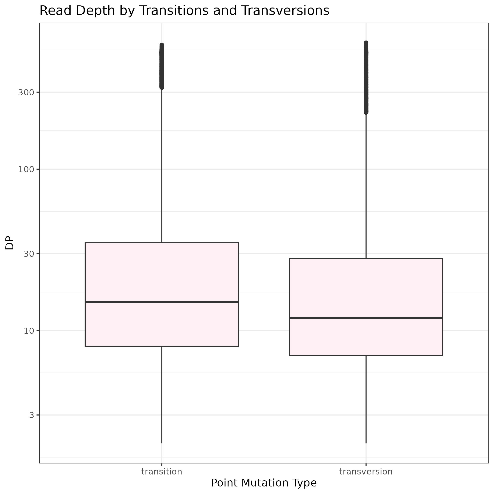

[](https://classroom.github.com/a/SzF8zjrH)
# Task 8. Read depth (DP) by Transitions and Transversions 

This pipeline allows assessing difference in the read depth (DP) between transitions and transversions. The pipeline comprises of two parts: data extraction (produces a tsv file with two columns&mdash;DP and info about mutation type: transition/transversion) and data analysis (creates a plot showing how is the DP distributed within the mutation types.

## 1. Data Extraction (Bash)

The data extraction part is represented by a script _workflow.sh_. To execute the script use: 
```
chmod +x workflow.sh
./workflow.sh
```

### Workflow.sh
This script takes a vcf file as an input and produces a tsv file with two columns&mdash;DP and mutation type&mdash;as its output. During this process, several things are done with the original vcf folder:

#### 1. Variables Definition
The filename and point mutation types (transition, transversion) are defined within this section.

> [!NOTE]
> The _luscinia_vars.vcf.gz_ file in the folder _data_ is set as the default input.

#### 2. DP Extraction
Using functions grep and awk, the DP data from individual entries (lines) are extracted into the _dp.tsv_ file. The awk code (using functions match and substr) was based on [Mark Needham's blog post](https://www.markhneedham.com/blog/2013/06/26/unixawk-extracting-substring-using-a-regular-expression-with-capture-groups/). If DP is not defined for an entry, `NA` is listed on its line.

#### 3. Mutation type extraction
Using functions grep and awk, the mutation type data were extracted into the _mutation_type.tsv_ file. There are four possible outputs for each entry – transition, transversion, `NA1` (indels or locī with more possible mutations, since those could be both transitions and transversion and the DP is given for the locus, such locī were omitted from the analysis) or `NA2` (undefined single-nucleotide exchange, should not exist in our data). The if condition structure was created with help of Google Gemini.

#### 4. Final Check
Using function wc -l and, echo and exit, the script checks if its previous sections worked and if the two tsv files (_dp.tsv_ and _mutation_type.tsv_) have same amount of entries. If not, the process is terminated.

#### 5. Merging the DP and mutation type data
Using functions paste and grep, only the lines containing defined DP and of entries composed of a single transition/transversion are taken and exported as a file _combined.tsv_.

#### 6. Removing the DP and mutation type tsv files
The intermediate files _dp.tsv_ and _mutation_type.tsv_ are deleted. 


## 2. Data Analysis (R)
The data analysis part is represented by a script _Rscript.R_. If `Rscript` is installed on the machine, one can run _workflowR.sh_ instead of _workflow.sh_. This script also involves one additional section:

#### 7. Rscript 
This runs the script _Rscript.R_

If Rscript is not loaded on the machine, one may engage in using online RStudio (either [NGS Course RStudio Server](https://ngs-course.behavio.dev/) or run own at [Posit Cloud](https://ngs-course.behavio.dev/)) and perform the _Rscript.R_ there.

### Rscript.R
This script takes the _combined.tsv_ file and creates a _DPplot.png_ file with boxplots (log y axis) showing the differences in DP between trnsitions and transversions. It is comprised of two section:

#### 1. Uploading a Dataframe
This section uploads data from _combined.tsv_ as a dataframe _d_.

#### 2. Plotting
This section creates the boxplot and saves it as _DPplot.png_.


## Results
If one preforms the analysis on the _luscinia_vars.vcf.gz_, they get such boxplots (showing slightly higher expected DP for transitions than tranversions):



